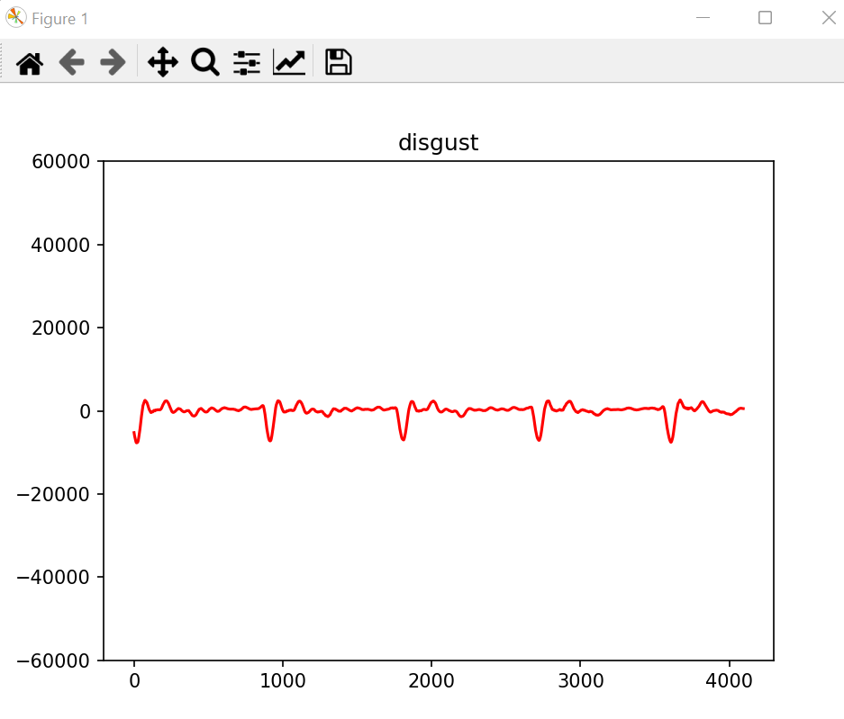

# Voice Emotion Prediction / Recognition with AI

I tried to use a voice emotion recognition AI to analyse an input stream from microphone, 
visualize the input stream and the prediction result.

Usage:
* Install all necessary Packages from Pipfile

 ## -> Train Model:
* Download or Create Dataset according to RavDess Dataset and Speech Emotion Recoginition
* Link the correct folder path in modeltrainer.py
* run modeltrainer.py

## -> Predict a .wav file (small file)
* Change file name / path in the last line
* 4 Testfiles are included
* run predicting.py

## -> Predict Microphone input Stream
* The input will be taken from the standard micophone setting
* Just run voiceinput.py

This project was created in Pycharm in Windows 11 Environemnt. 

This project is a composition of 
* Speech Emotion Recognition
  * https://data-flair.training/blogs/python-mini-project-speech-emotion-recognition/
* Voice Spectrum Visulization
  * https://fazals.ddns.net/spectrum-analyser-part-1/
* RavDess Dataset:
  * https://drive.google.com/file/d/1wWsrN2Ep7x6lWqOXfr4rpKGYrJhWc8z7/view
 
